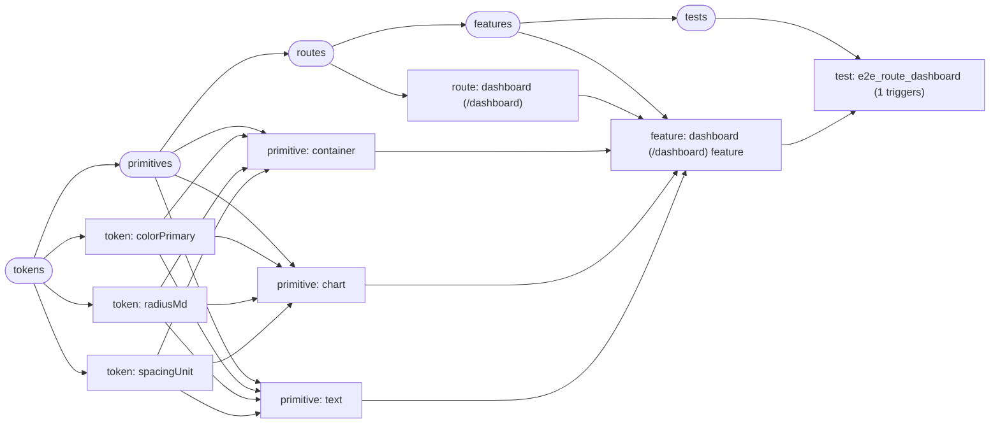

# Schema Task DAG

- Source: `fixtures/schema-references/sample-01-dashboard.json`
- Generated: 2026-04-08T08:54:17.887Z

## Summary

- tokens: 3
- primitives: 3
- routes: 1
- features: 1
- tests: 1
